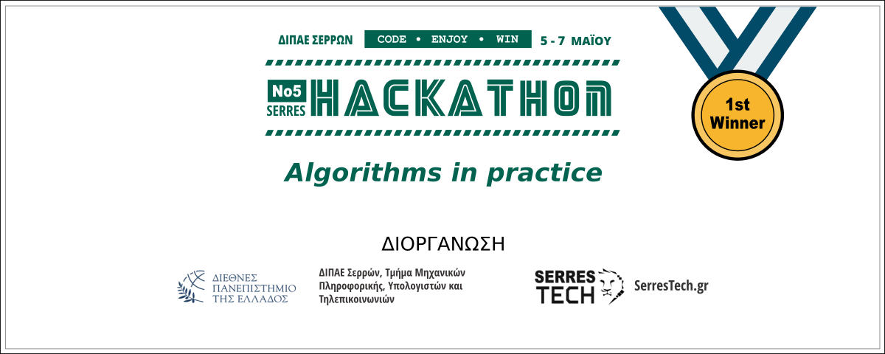

# Tetris Tiler - frontend

Solving the [SerresHack 2023 topic](https://hackathon.serrestech.gr).

## About

Tetris Tiler is our approach to find an innovative way to sell strange tiles so our company doesn't have to throw them away or recycle them back.

We use several approaches to generate and come up with new ideas with the help of Computer Science by implementing the Polyomino Tiling Algorithm. More specifically, we have created a user friendly environment that lets the user choose different tasks that each one returns different tiling outputs. The user through these tasks has the option to control the grid size, the shapes for the grid and their rotations.

Because we want fast results we counted the time our algorithms take to run and we print them as it is a crucial information.

## Team

- Frontend Developers:
  - Alexander Papaefthimiou
  - Elias Sahlos
- Backend Developers:
  - Maciej Ratkiewicz
  - Ermina Trontzou

## Technical details

- Backend Development:
Spring Boot version 3.0.6

## Requirements

For github clone :

Install Open JDK

## Install

If you want to use our code, simply clone the repositories from github.

If you want to check out the implementation of the code, check out our Live Demo.

## Run

Simply click the Run button from your software.

## Live demo

Find us at : <https://tetristiles.vercel.app/>

For the live demo to work you will need to disable Insecure content from the site settings. This occurs because our backend app from which next.js calls the api's of the functions is set up to a non https server.

## License

[MIT](LICENSE)
